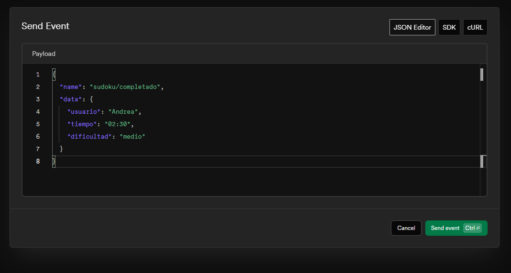
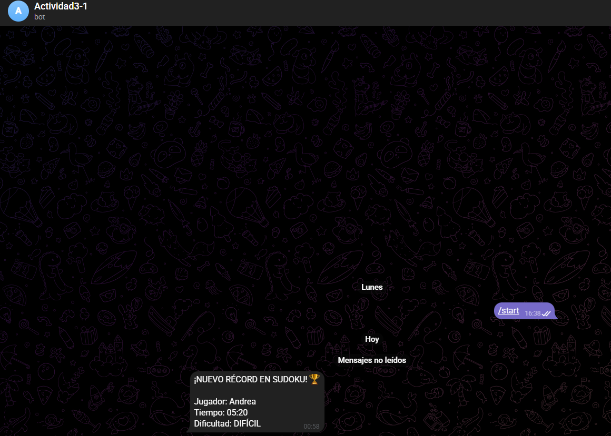

# Proyecto Sudoku: Sistema de Notificaciones con Inngest

Este proyecto implementa  eventos para la gestión de puntuaciones en un juego de Sudoku, integrando notificaciones en tiempo real a través de Telegram.

## 1: Crear el bot de Telegram
Creamos el bot siguiendo los pasos dados en el repositorio del profesor y obtenemos el token y el chat_id, que lo conseguí preguntándole a un bot que nos da esa información.

## 2: Crear el servicio de mensajes
Para no cambiar nada del código actual se creó una carpeta nueva:
* **Archivo `utils/telegram.js`:** Se añadió una función que conecta con la API de Telegram usando `fetch`.

## 3: Implementar Inngest
Según lo proporcionado en clase, creé también un cliente y una función
1.  **Cliente Inngest:** Configuré el cliente en `inngest/client.js`.
2.  **Función de Notificación:** Creé una función en `inngest/functions/sudoku-functions.js` que se activa únicamente cuando recibe el evento `sudoku/completado`.
3.  **Middleware:** Conecté Inngest al servidor Express mediante el endpoint `/api/inngest`..

## 4: Pruebas y validación
Para verificar que todo el flujo funcionaba sin errores, seguí estos pasos:
1.  Inicié el servidor backend (`node server.js`).
2.  Levanté el entorno de desarrollo de Inngest (`npx inngest-cli@latest dev`).
3.  Utilicé el **JSON Editor** de Inngest para simular una victoria en el Sudoku.
4.  **Resultado:** El mensaje llegó al instante a mi chat de telegram.

## Capturas de los pasos y resultado

### Registro de ejecución en Inngest
En esta captura se puede observar cómo probamos con unos datos en el panel de inngest.

### Notificación Recibida
Resultado final en el chat de Telegram con los datos del jugador:

## Cómo ejecutar el proyecto
1.  Ejecutar `npm install`.
2.  Configurar las credenciales en el archivo `.env`.
3.  Terminal 1: `node server.js`
4.  Terminal 2: `npx inngest-cli@latest dev -u http://localhost:3000/api/inngest`
